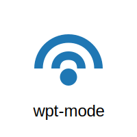

# WiFi Pentesting Mode Tool (wpt-mode)



This Python script simplifies switching between monitor mode and managed mode on a WiFi interface, allowing for efficient scanning and monitoring during penetration testing.

## Features

- **Start Monitor Mode**: Activate monitor mode on a specified WiFi interface (`airmon-ng check kill` and `airmon-ng start <interface>`).
- **Exit Monitor Mode**: Deactivate monitor mode (`airmon-ng stop <interface>`) and restart NetworkManager (`service NetworkManager start`).
- **Rescan WiFi Networks**: Automatically rescan WiFi networks after exiting monitor mode.

## Requirements

- Python 3.x
- airmon-ng
- NetworkManager
- nmcli

## Installation

1. **Clone the Repository:**

   ```bash
   git clone https://github.com/sampson-q/wpt-mode.git
   cd wpt-mode
   ```

2. **Setup Script:**

   Run the setup script (`setup.sh`) to install dependencies and make `wpt-mode` executable from anywhere:

   ```bash
   chmod +x setup.sh
   ./setup.sh
   ```

3. **Usage:**

   ```bash
   Usage: wpt-mode [--start | -s | --exit | -e | --rescan | -r] <interface> [options]

   Options:
     -h, --help                   Display this help message and exit
     -d, --delay <seconds>        Set custom delay before rescan (default is 4 seconds)

   Commands:
     --start, -s                  Start monitor mode on specified interface
     --exit, -e                   Exit monitor mode and restart NetworkManager
     --rescan, -r                 Rescan WiFi networks after exiting monitor mode
   ```

   Examples:
   ```bash
     wpt-mode --start wlan0
     wpt-mode --exit wlan0
     wpt-mode --rescan wlan0 -d 6
   ```

4. **Examples:**

   - Start monitor mode on interface `wlan0`:
     ```bash
     wpt-mode --start wlan0
     ```

   - Exit monitor mode on interface `wlan0` and restart NetworkManager:
     ```bash
     wpt-mode --exit wlan0
     ```

   - Rescan WiFi networks with a custom delay of 6 seconds after exiting monitor mode:
     ```bash
     wpt-mode --rescan wlan0 -d 6
     ```

## Case Study: Switching Between Monitor and Managed Modes

Using `wpt-mode` simplifies the process of switching between monitor mode and managed mode on a WiFi interface during penetration testing. Here's how the tool improves efficiency:

1. **Starting Monitor Mode**:
   - Executes `airmon-ng check kill` to kill any processes that might interfere.
   - Executes `airmon-ng start <interface>` to activate monitor mode on the specified interface.

2. **Exiting Monitor Mode**:
   - Executes `airmon-ng stop <interface>` to deactivate monitor mode.
   - Restarts NetworkManager using `service NetworkManager start` to restore normal network functionality.

3. **Rescanning WiFi Networks**:
   - After exiting monitor mode, automatically rescans WiFi networks using `nmcli device wifi list`.

By automating these steps, `wpt-mode` reduces the time and effort required to switch modes and perform essential tasks during WiFi penetration testing.